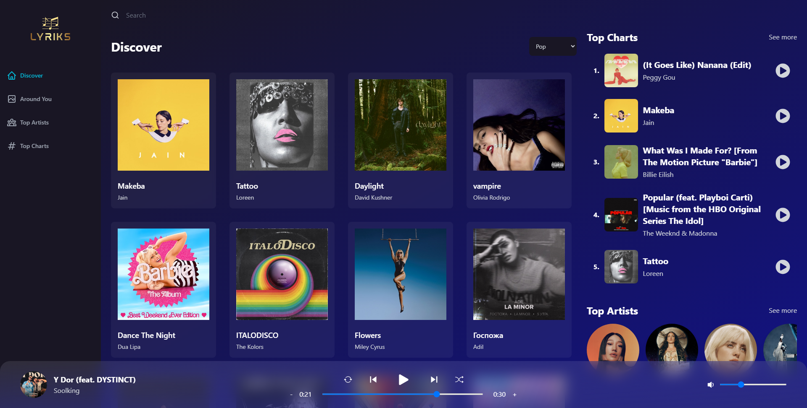

<h1 align="center">Spotify 2.0</h1>
<p align="center">Welcome to Spotify 2.0, an enhanced music discovery app built with React and Redux and Rapid Api (Shazam api). Explore your favorite tracks, artists, and genres like never before.</p>
<p align="center">
  
  <a href="https://github.com/kefranabg/readme-md-generator/blob/master/LICENSE">
    
  </a>
</p>



## Live Preview
Check out the live preview of the app: [Live Preview](https://nordinefr-spotify-v2.netlify.app/)

## Table of Contents
- [Getting Started](#getting-started)
- [Features](#features)
- [Usage](#usage)
- [Contributing](#contributing)
- [License](#license)

## Getting Started
Follow these steps to get the app up and running on your local machine:

1. Clone this repository:
   ```bash
   git clone https://github.com/NordineFR/Spotify-2.0.git
   cd spotify-2.0
   ```
2. Install the dependencies:
   
   ```bash
   npm install
   ```
4. Create an .env file in the root directory based on the .env.example template:
   
   ```bash
   cp .env.example .env
   ```
6. Open the .env file and replace the placeholder API keys with your actual API keys.
   
8. Start the development server:
   
   ```bash
   npm start
   ```
10. **Open your browser and navigate to `http://localhost:3000` to use the app.**

## Features
- Discover top tracks and artists based on charts and genres.
- Get detailed information about songs and artists.
- Find related tracks and recommendations.
- Search for your favorite songs, albums, and artists.

## Usage
Explore the app's features and functionalities:

- **Home:** View the top charts and explore different genres.
- **Search:** Look up tracks, artists, and albums using the search bar.
- **Track Details:** Click on a track to see its details and related songs.
- **Artist Details:** Learn more about artists and their top tracks.
- **Discover:** Get recommendations and explore related tracks.

## Contributing
Contributions are welcome! To contribute to Spotify 2.0, follow these steps:

1. Fork this repository.
2. Create a new branch: `git checkout -b feature/your-feature-name`.
3. Commit your changes: `git commit -m "Added new feature"`.
4. Push the branch: `git push origin feature/your-feature-name`.
5. Create a pull request.

## License
This project is licensed under the [MIT License](LICENSE).


